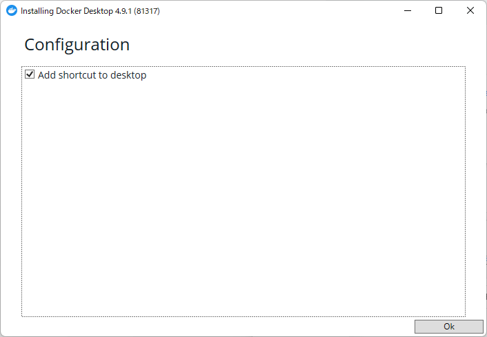
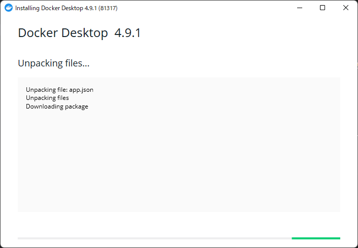
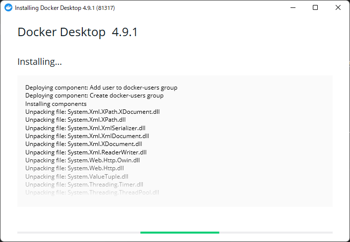
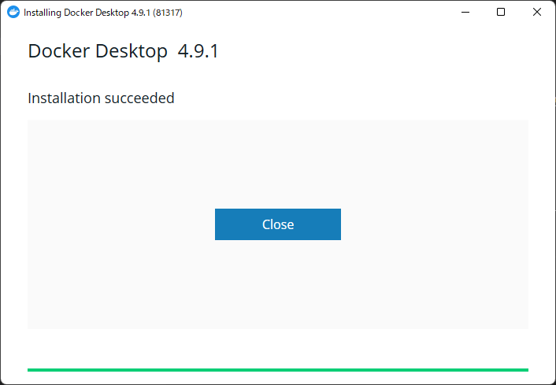
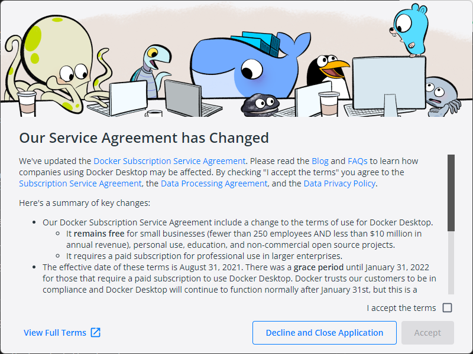
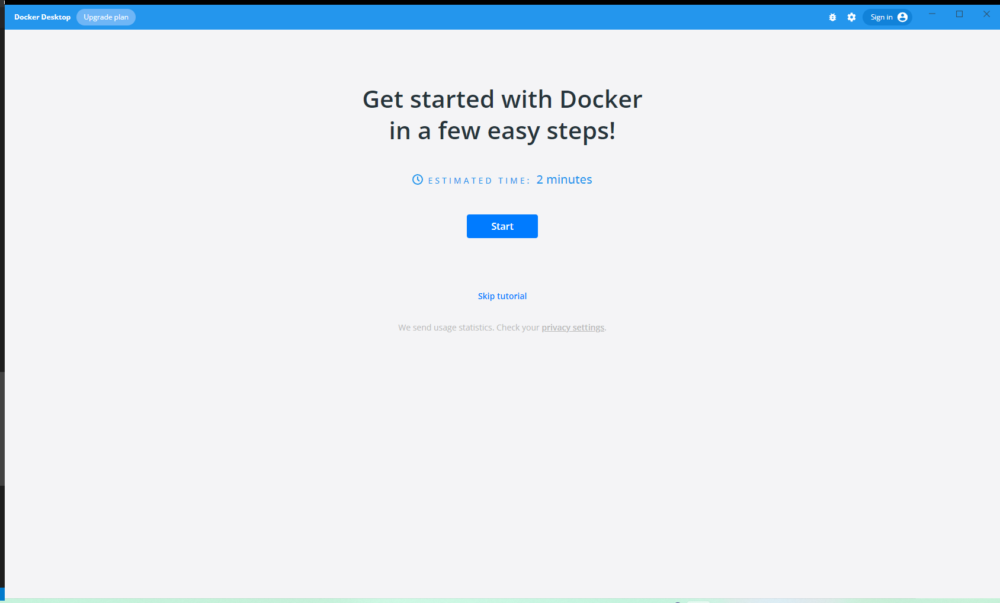
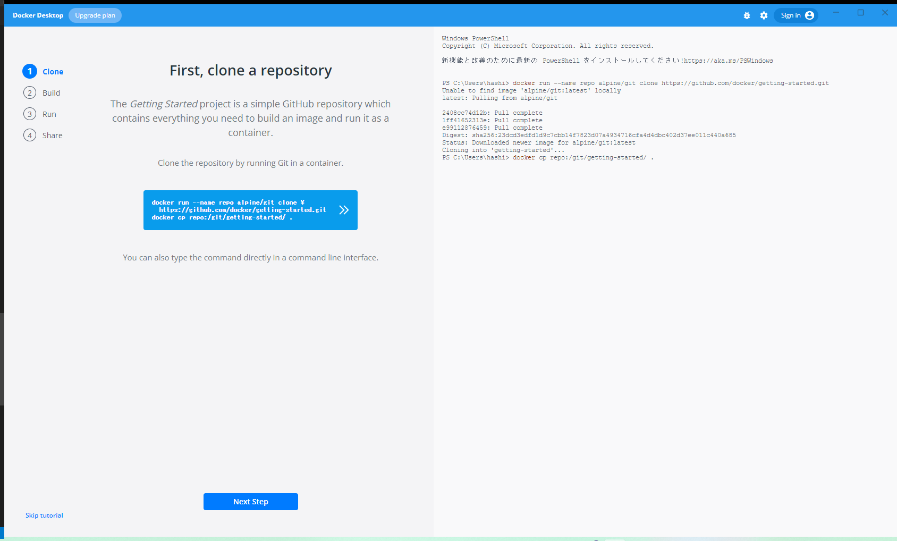
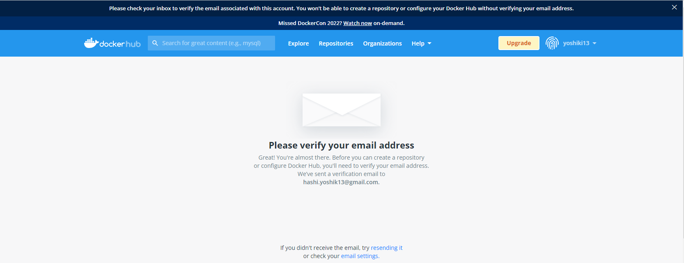
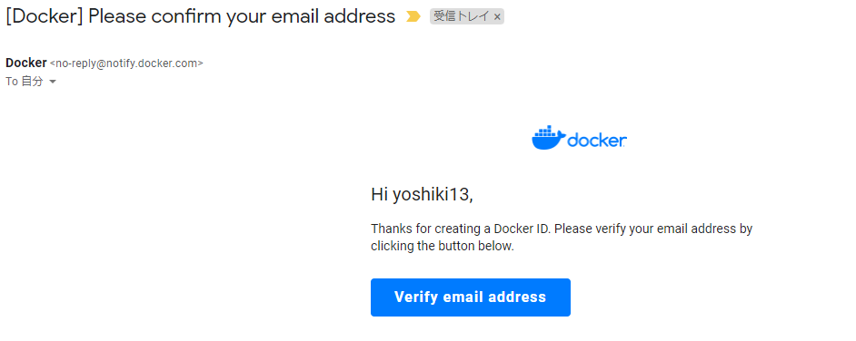

# Docker環境構築手順

## 前提条件

- OSは、Windows 11 Home 64bit
<br>
<br>

## システム要件

- Windows 10 64 ビット：Pro、Enterprise、Education（ビルド 15063 以上）
- Hyper-V と Windows コンテナ機能の有効化が必要
- 以下は、Windows 10 以上で Hyper-V クライアントを問題なく実行するために必要なハードウェア要件
  - 64 ビット SLAT （Second Level Address Translation 対応プロセッサ
  - 4GB システムメモリ
  - BIOS レベルでのハードウェア仮想化が、BIOS 設定で有効にする必要。詳細な情報は 仮想化 を参照
<br>
<br>
---

### Docker Desktopのインストール

---
<br>

- [このリンク](https://docs.docker.com/desktop/windows/install/)の**Docker Desktop for Windows**をクリックしてインストーラーをダウンロードする。

.png)

- インストールしたインストーラーを実行する

Okボタンを押下。

- Docker Desktop for Windowsのダウンロード、インストールが開始する




- 下の画面が表示されたらインストールが完了するので**Close**を押下する。


---

### Docker Desktop for Windowsの初回起動

---

- デスクトップに作成されたショートカットをダブルクリックすると下のウィンドウが表示される。

**I accept the terms**にチェックを入れて、**Accept**を押下する。

- 下のような画面が表示されたら問題なくDocker Desktop for Windowsが起動できている


<br>

---

### Dockerチュートリアル

---

<br>

**Start**ボタンを押下すると下の画面が表示される。
コンテナでGitを実行してリポジトリのクローンを作成するために、真ん中のコードが記載されたボタンを押下する。

※上の画面はそのボタンを押下した後の画面。  
右側の画面にコマンド（`docker cp repo:/git/getting-started/ .`）が表示されるのでそのコマンドを実行するために右側の画面の空白の部分をクリックしてからEnterキーを押下する。

- **Next Step**ボタンを押下して次の画面に遷移する

- 以降、下記の作業を繰り返す。
  - 真ん中のコマンドが表示されているボタンを押下
  - 処理が終わっても右側の画面にコマンドが表示されていれば、そのコマンドを実行する

    - Docker Hubにサインインしていないと**Sign in here**が表示されるので、そのリンクをクリックしてDocker Hubにサインインする。Docker ID（Docker Hubにサインインするために必要なもの）がない場合はリンククリック後の右上の**Sign Up**をクリックしてDocker IDを作成する。

    - 必要事項を入力し料金プランを選択すると下の画面が表示されるので入力したメールアドレスの受信ボックスを確認する。


    - 受信ボックスを確認すると下のメールがあるので、**Verify email address**ボタンを押下してメールアドレスを確認する。


- 真ん中のコマンドが表示されているボタンを押下してコマンドを実行した後、**Done**ボタンが表示されたらクリックするとチュートリアルが終了する。

<br>

---

### 各種設定有効化／WSL2Linuxカーネル更新※Docker Desktopが上手く起動しない場合に確認

---
- コマンドプロンプトで下記コマンドを実行して、powershellを管理者権限で起動する。

```コマンドプロンプト
@powershell -NoProfile -ExecutionPolicy unrestricted -Command "Start-Process PowerShell.exe -Verb runas"
```

- 下記コマンドを実行して、WSL(Windows Subsystem for Linux)を有効にする。

```PowerShell
Enable-WindowsOptionalFeature -Online -FeatureName Microsoft-Hyper-V-All
```

- 下記コマンドを実行して、仮想マシンの機能を有効にする

```PowerShell
dism.exe /online /enable-feature /featurename:VirtualMachinePlatform /all /norestart
```

- [このリンク](https://docs.microsoft.com/ja-jp/windows/wsl/install-manual#step-4---download-the-linux-kernel-update-package)を参考にして、**x64マシン用WSL2 Linuxカーネル更新プログラムパッケージ**をダウンロードして実行する
